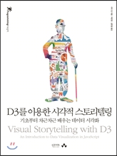
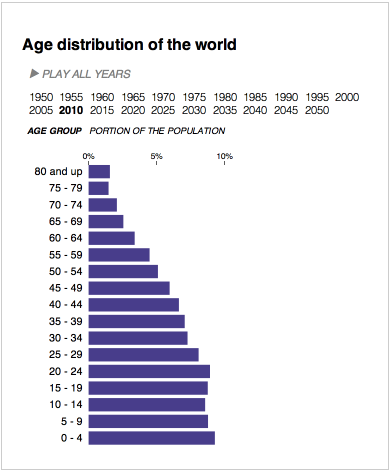
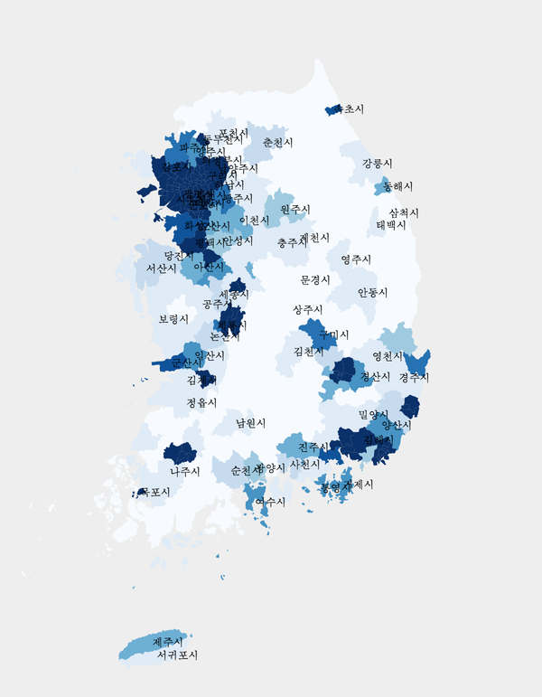

D3를 이용한 시각적 스토리텔링
=======

"D3를 이용한 시각적 스토리텔링"에 나오는 예시 코드 모음.

## 책에 대하여

- __[목차](table-of-contents.md)__
- 2015년 6월 26일부터 예약 판매!
- 자바스크립트의 [훌륭한 D3.js 라이브러리](http://d3js.org/)에 대한 입문서입니다. 지금부터 온라인 서점에서 구하실 수 있습니다.
    - [yes24](http://www.yes24.com/24/Goods/18745807)
    - [알라딘](http://www.aladin.co.kr/shop/wproduct.aspx?ISBN=8966261418)

## 책에서 중점으로 다루는 예제

- 막대 그래프 하나를 그리더라도 제대로 그리기! (본문)

- 우리나라 인구밀도 코로플래스 그리기! (부록 C)

